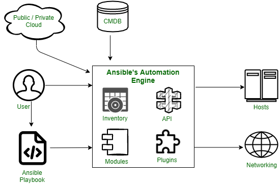

# Ansible Architecture

The Ansible automation engine consists of various components as described below as follows.

**Inventories –**
Ansible inventories are lists of hosts with their IP addresses, servers, and databases which have to be managed via an SSH for UNIX, Linux, or Networking devices, and WinRM for Windows systems.
 
**APIs –** 
Application Programming Interface or APIs are used as a mode of transport for public and private cloud services.
 
**Modules –** 
Modules are executed directly on remote hosts through playbooks and can control resources like services, packages, files, or execute system commands. They act on system files, install packages and make API calls to the service network. There are over 450 Ansible that provide modules that automate various jobs in an environment. For example, Cloud Modules like Cloud Formation create or delete an AWS cloud formation stack.

**Plugins –** 
Plugins are pieces of code that augment Ansible’s core functionality and allow executing Ansible tasks as a job build step. Ansible ships with several handy plugins and one can also write it on their own. For example, Action plugins act as front-ends to modules and can execute tasks on the controller before calling the modules themselves.
 
**Networking –** 
Ansible uses a simple, powerful, and agent-less automation framework to automate network tasks. It uses a separate data model and spans different network hardware.
 
**Hosts –** 
Hosts refer to the nodes or systems (Linux, Windows, etc) which are automated by Ansible.
 
**Playbooks –** 
Playbooks are simple files written in YAML format which describe the tasks to be executed by Ansible. Playbooks can declare configurations, orchestrate the steps of any manual ordered process and can also launch various tasks.
