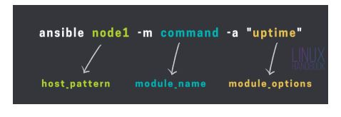

#  Ad­Hoc Commands in Ansible

An Ansible ad-hoc command is a great tool that you can use to run a single task
on one or more managed nodes. A typical Ansible ad-hoc command follows the
general syntax:

```shell
ansible host_pattern -m module_name -a ”module_options”
```

The easiest way to understand how Ansible ad-hoc commands work is simply running one! So, go ahead and run the following ad-hoc command:

```
[<user>@control plays]$ ansible node1 -m command -a "uptime"
Enter passphrase for key '/home/<user>/.ssh/id_rsa':
node1 | CHANGED | rc=0 >>
18:53:01 up 5 days, 18:03, 1 user, load average: 0.00, 0.01, 0.00

```



